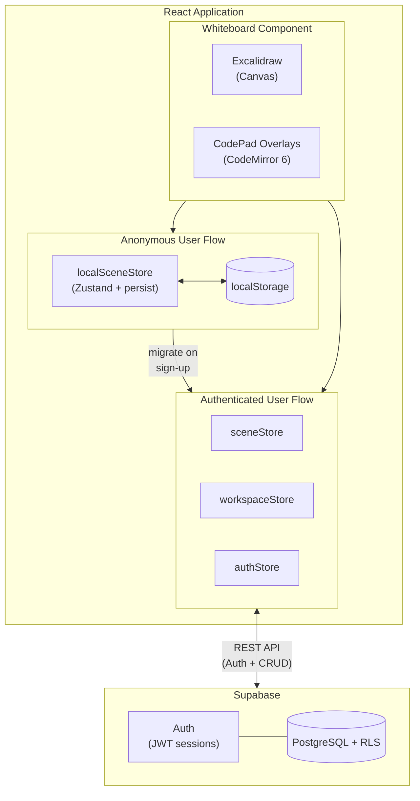
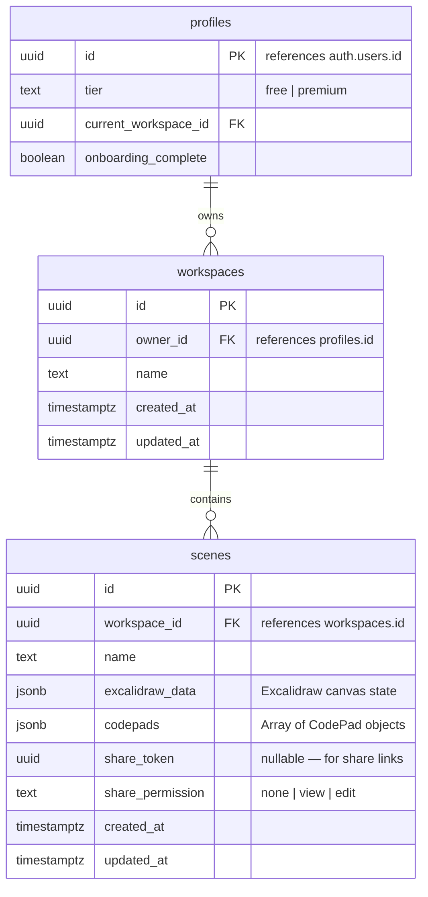

<p align="center">
  
</p>

[](https://react.dev/)
[](https://www.typescriptlang.org/)
[](https://vite.dev/)
[](https://supabase.com/)
[](https://tailwindcss.com/)
[](https://unifii.vercel.app)
[](LICENSE)


<div>
 <h3 align="center">U&I - Ideate. Code. Create</h3>

> A collaborative whiteboard application live on [unifii.vercel.app](https://unifiy.vercel.app) with integrated code editing capabilities. Sketch ideas, write code, and organize your creative workflow - all on one infinite canvas.
</div>

> **Live Demo** - [unifii.vercel.app](https://unifiy.vercel.app)

## Table of Contents

- [Features](#features)
- [Tech Stack](#tech-stack)
- [Architecture](#architecture)
- [Getting Started](#getting-started)
- [Project Structure](#project-structure)
- [Environment Variables](#environment-variables)
- [Database Schema](#database-schema)
- [Routes](#routes)
- [Keyboard Shortcuts](#keyboard-shortcuts)
- [Scripts](#scripts)
- [Contributing](#contributing)
- [License](#license)

---

## Features

### Canvas & Drawing
- Infinite whiteboard powered by Excalidraw
- Dark and light mode support
- Auto-save with debounced writes
- Scene renaming (double-click the title)

### CodePad - Code on the Canvas
- Embedded code editor widgets powered by CodeMirror 6
- **Multi-language support** - JavaScript, Python, HTML, CSS, JSON, Java, Markdown
- Draggable and resizable editor windows
- Minimize, maximize, and close controls
- Copy-to-clipboard for code snippets
- Tier-based limits: Free users get up to 3 CodePads per scene

### Authentication & User Management
- Anonymous mode - start drawing immediately, data saved to localStorage
- Email/password authentication via Supabase Auth
- Automatic data migration from localStorage to your account on sign-up
- Guided onboarding flow for new users

### Workspaces & Scenes
- Organize scenes into workspaces
- Create, rename, and delete scenes from the dashboard
- Switch between workspaces with the workspace switcher
- Tier-based workspace limits (Free: 1 workspace, Premium: unlimited)

### Sharing
- Generate view-only share links with secure UUID tokens
- Public access to shared scenes - no login required
- Revoke share links at any time
- Copy-to-clipboard share URLs

### Landing Page
- Animated marketing page with Framer Motion
- Hero section, feature highlights, integration showcase, and bento grid layout
- Responsive design across all breakpoints

---

## Tech Stack

| Layer | Technology |
|-------|-----------|
| **Framework** | React 19 + TypeScript |
| **Build Tool** | Vite 5 |
| **Canvas** | Excalidraw 0.18 |
| **Code Editor** | CodeMirror 6 |
| **State Management** | Zustand 5 (with persist middleware) |
| **Backend / Auth** | Supabase (PostgreSQL + Auth + Row Level Security) |
| **Styling** | Tailwind CSS 3.4 |
| **Animations** | Framer Motion |
| **Routing** | React Router 7 |
| **Icons** | Lucide React |
| **Toasts** | Sonner |
| **Deployment** | Vercel |

---

## Architecture

U&I uses a **dual-mode architecture** to support both anonymous and authenticated users:



**Anonymous users** start drawing immediately. All data persists in the browser via `localSceneStore` (Zustand with persist middleware). When a user signs up, the onboarding flow automatically migrates their local work into Supabase.

**Authenticated users** get full access to workspaces, multiple scenes, sharing, and cloud persistence through `sceneStore` and `workspaceStore`, both backed by Supabase with Row Level Security.

---

## Getting Started

### Prerequisites

- [Node.js](https://nodejs.org/) v18+
- npm
- A [Supabase](https://supabase.com/) project (for authentication and cloud storage)

### Installation

```bash
# Clone the repository
git clone https://github.com/Pin3appl3ishan/unifiy.git
cd unifiy

# Install dependencies
npm install

# Create a .env file with your Supabase credentials (see Environment Variables below)

# Start the development server
npm run dev
```

The app will open at **http://localhost:3000**.

---

## Project Structure

```
src/
├── components/
│   ├── CodePad/
│   │   └── CodePad.tsx              # CodeMirror editor widget (drag, resize, minimize)
│   ├── Landing/
│   │   ├── Navbar.tsx               # Navigation bar with auth links
│   │   ├── Hero.tsx                 # Animated hero section
│   │   ├── Integrations.tsx         # Tool/feature showcase
│   │   ├── FeatureSection.tsx       # Alternating feature highlights
│   │   ├── BentoGrid.tsx            # Grid layout for benefits
│   │   ├── Footer.tsx               # Site footer
│   │   └── index.ts                 # Barrel export
│   ├── Onboarding/
│   │   └── OnboardingModal.tsx      # New user welcome + data migration
│   ├── ShareModal/
│   │   └── ShareModal.tsx           # Share link generation and management
│   ├── Whiteboard/
│   │   └── Whiteboard.tsx           # Excalidraw + CodePad integration + auto-save
│   ├── Workspace/
│   │   └── CreateWorkspaceModal.tsx # Workspace creation form
│   ├── WorkspaceSwitcher/
│   │   └── WorkspaceSwitcher.tsx    # Workspace dropdown selector
│   ├── ui/
│   │   ├── Skeleton.tsx             # Skeleton + Skeleton.Text + Skeleton.Circle
│   │   ├── Spinner.tsx              # Spinner + PageSpinner
│   │   ├── DashboardSkeleton.tsx    # Dashboard loading skeleton
│   │   └── CanvasSkeleton.tsx       # Canvas loading skeleton
│   ├── ErrorBoundary.tsx            # React error boundary (class component)
│   ├── ErrorFallback.tsx            # Reusable error display with retry
│   ├── ProtectedRoute.tsx           # Auth guard for protected routes
│   └── index.ts                     # Barrel export
├── pages/
│   ├── Canvas.tsx                   # Main canvas (anonymous + authenticated)
│   ├── Dashboard.tsx                # Scene management dashboard
│   ├── Landing.tsx                  # Marketing landing page
│   ├── Login.tsx                    # Login page
│   ├── Signup.tsx                   # Registration page
│   └── SharedScene.tsx              # Public shared scene viewer
├── stores/
│   ├── authStore.ts                 # Authentication + user profiles + onboarding
│   ├── localSceneStore.ts           # Anonymous user data (localStorage via persist)
│   ├── sceneStore.ts                # Remote scene CRUD + sharing (Supabase)
│   └── workspaceStore.ts            # Workspace management
├── lib/
│   ├── supabase.ts                  # Supabase client configuration
│   ├── errors.ts                    # Custom error classes (AppError, AuthError, NetworkError, etc.)
│   └── logger.ts                    # Structured error logging utility
├── types/
│   └── index.ts                     # Centralized shared interfaces and types
├── constants/
│   └── index.ts                     # Magic numbers, strings, toast messages, limits
├── styles/
│   └── index.css                    # Tailwind + custom styles
├── App.tsx                          # Route configuration + lazy loading
└── main.tsx                         # Entry point + ErrorBoundary + Toaster
```

---

## Environment Variables

Create a `.env` file in the project root:

```env
VITE_SUPABASE_URL=https://your-project.supabase.co
VITE_SUPABASE_ANON_KEY=your-anon-key
```

You can find these values in your [Supabase project settings](https://app.supabase.com/) under **Settings > API**.

---

## Database Schema

The application uses three core tables in Supabase with Row Level Security enabled:



---

## Routes

| Route | Auth | Description |
|-------|------|-------------|
| `/` | No | Anonymous canvas (redirects to `/workspace` if logged in) |
| `/landing` | No | Marketing landing page |
| `/login` | No | Login page |
| `/signup` | No | Registration page |
| `/scene/:sceneId/shared/:token` | No | Public shared scene (view-only) |
| `/workspace` | Yes | Dashboard — manage scenes and workspaces |
| `/scene/:id` | Yes | Scene editor (authenticated) |

---

## Keyboard Shortcuts

| Shortcut | Action |
|----------|--------|
| `Ctrl/Cmd + Shift + C` | Add a new CodePad to the canvas |

All standard Excalidraw keyboard shortcuts are also available on the canvas.

---

## Scripts

```bash
npm run dev       # Start development server on port 3000
npm run build     # Type-check with tsc, then build for production
npm run preview   # Preview the production build locally
npm run lint      # Run TypeScript type checking (tsc --noEmit)
```

---

## Contributing

1. Fork the repository
2. Create a feature branch (`git checkout -b feature/your-feature`)
3. Commit your changes (`git commit -m 'Add your feature'`)
4. Push to the branch (`git push origin feature/your-feature`)
5. Open a Pull Request

---

## License

This project is licensed under the [MIT License](LICENSE).
